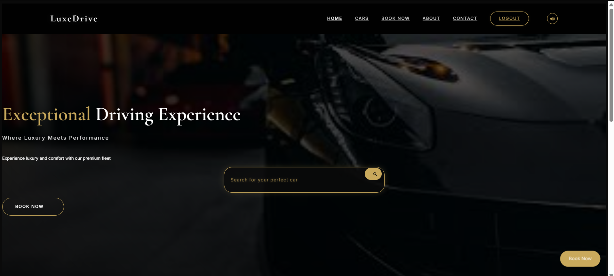

# LuxeDrive - Premium Car Rental Service

(./images/homepagebottom.png)

A modern web application offering a seamless and premium car rental experience for customers looking for luxury vehicles.

---

## 📑 Table of Contents

- [Features](https://github.com/Aditya-Agrahari1/Car-Rental-Website/blob/main/README.md#-features)
- [Configuration](https://github.com/Aditya-Agrahari1/Car-Rental-Website/blob/main/README.md#%EF%B8%8F-configuration)
- [Technology Stack](https://github.com/Aditya-Agrahari1/Car-Rental-Website/blob/main/README.md#-technology-stack)
- [Getting Started](https://github.com/Aditya-Agrahari1/Car-Rental-Website/blob/main/README.md#-getting-started)
- [Usage](https://github.com/Aditya-Agrahari1/Car-Rental-Website/blob/main/README.md#-usage)
- [Admin Registration](https://github.com/Aditya-Agrahari1/Car-Rental-Website/blob/main/README.md#%EF%B8%8F-admin-registration)
- [Contributing](https://github.com/Aditya-Agrahari1/Car-Rental-Website/blob/main/README.md#-contributing)
- [License](https://github.com/Aditya-Agrahari1/Car-Rental-Website/blob/main/README.md#-license)

---

## ✨ Features

### 🔐 User Authentication
- Secure login and registration system
- Token-based authentication (JWT)
- Admin dashboard for inventory management

### 🚗 Car Management
- Browse available luxury vehicles
- Real-time inventory tracking
- Detailed car specifications
- Image upload for new vehicles

### 📅 Booking System
- Easy-to-use booking interface
- Real-time availability checking
- Secure payment processing
- Booking history tracking

### 🛠️ Admin Features
- Add new vehicles to fleet
- Manage car inventory
- Track bookings
- Restock vehicles
- Multi-admin support with secure registration
- Role-based access control
- Email notifications for customer inquiries

### 📬 Contact System
- User-friendly contact form
- Automated email notifications to admins
- Customer inquiry tracking
- Real-time message delivery
- Support ticket management

---

## ⚙️ Configuration

Create a `.env` file in the root directory and add the following environment variables:

```plaintext
MONGODB_URI=mongodb://127.0.0.1:27017/luxedrive
JWT_SECRET=your_jwt_secret_key
PORT=5000
ADMIN_REGISTRATION_KEY=132456789
EMAIL_USER=your_email@example.com
EMAIL_PASS=your_email_password  # Use an app password, not your main email password
```

---

## 💻 Technology Stack

### Frontend
- HTML5
- CSS3
- JavaScript (Vanilla)
- Font Awesome Icons

### Backend
- Node.js
- Express.js
- MongoDB
- JWT Authentication

---

## 🚀 Getting Started

### Prerequisites
- Node.js (v14 or higher)
- MongoDB
- Modern Web Browser

### Installation

```bash
# Clone the repository
git clone https://github.com/Aditya-Agrahari1/Car-Rental-Website.git

# Navigate to project directory
cd Car-Rental-Website

# Install dependencies
npm install

# Start the server
npm start
```

---

## 👥 Usage

### Customer Interface
- Visit the homepage to browse available cars
- Register or login to make bookings
- View booking history and manage reservations

### Admin Interface
- Access admin dashboard at `/admin.html`
- Add new vehicles to the fleet
- Manage inventory and stock levels
- Monitor bookings and user activities

---

## 🛡️ Admin Registration

### Security
- Secure admin registration system
- Protected by registration key
- Role-based authentication
- Individual admin accounts with activity tracking

### Admin Privileges
- Full inventory management
- User booking oversight
- Stock management
- System configuration access

### Registration Process
- Access admin registration at `/admin-register.html`
- Requires authorized admin registration key
- Collects essential admin information:
  - Full Name
  - Email
  - Password
  - Contact Details
  - Address

---

## 🤝 Contributing

Contributions are welcome! Feel free to fork this repository, create a feature branch, and submit a pull request.  
For major changes, please open an issue first to discuss what you'd like to change.

---

## 📄 License

This project is licensed under the [MIT License](LICENSE).

---

> 💬 For inquiries or suggestions, feel free to reach out via [agrahariaditya005@gmail.com](mailto:agrahariaditya005@gmail.com) or message me on [Telegram](https://t.me/xKiteretsu)!

